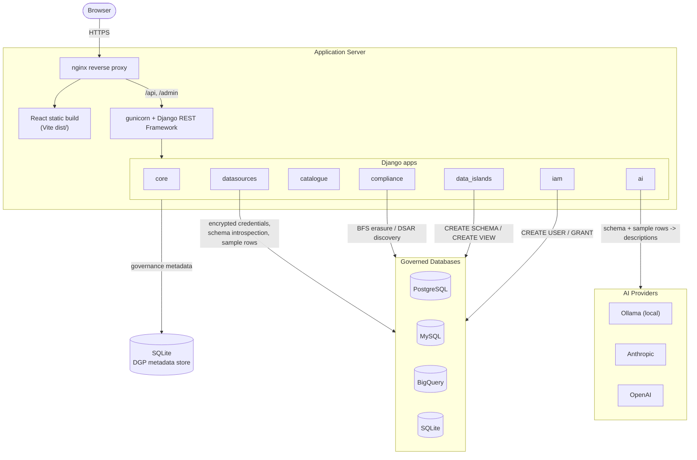

# The Data Governance Project (DGP)

An enterprise data governance platform that connects to your databases, auto-generates AI-powered data catalogues, detects PII, maps relationships between tables, and manages compliance workflows — including right-to-erasure and data subject access requests under India's DPDPA, 2023 (and GDPR-adjacent workflows).

> **Honesty note on this document:** every feature below is described based on what is actually implemented in the codebase on the `DEV` branch as of this writing — not aspirational copy. Where a feature is a UI placeholder with no backend behind it yet, it is explicitly marked **Coming Soon**, not "Live."

---

## Table of Contents

1. [Features](#features)
2. [Platform Assumptions](#platform-assumptions)
3. [DPDPA, 2023 Compliance Mapping](#dpdpa-2023-compliance-mapping)
4. [Project Structure](#project-structure)
5. [Pre-Installation Requirements](#pre-installation-requirements)
6. [Local Development Setup](#local-development-setup)
7. [Docker (Local / Trial Use)](#docker-local--trial-use)
8. [Deploying to a Production Application Server](#deploying-to-a-production-application-server)
9. [Architecture](#architecture)
10. [Authentication](#authentication)
11. [API Reference](#api-reference)
12. [Key Dependencies](#key-dependencies)
13. [Roadmap / Known Gaps](#roadmap--known-gaps)

---

## Features

| Feature | Status |
|---------|--------|
| Data source management (PostgreSQL, MySQL, BigQuery, SQLite) | ✅ Live |
| AI-powered catalogue generation (table + column descriptions) | ✅ Live |
| PII detection and tagging | ✅ Live |
| AI-inferred table relationships (feeds the Data Map + compliance engine) | ✅ Live |
| Human overrides for AI-generated metadata | ✅ Live |
| Catalogue run history with live progress tracking | ✅ Live |
| Data Map — FK relationship visualisation and rule management | ✅ Live |
| Data Islands (governed SQL VIEW sandboxes per team) | ✅ Live |
| IAM — real DB user provisioning, DB role sync, access groups | ✅ Live |
| Compliance — Full Erasure (DPDPA Section 12 / GDPR Article 17) | ✅ Live |
| Compliance — Data Access Request / DSAR (DPDPA Section 11) | ✅ Live |
| Compliance — RLS & Column Obfuscation | 🚧 Coming Soon (UI shell only, no backend) |
| Compliance — Retention Policy (scheduled purge) | 🚧 Coming Soon (UI shell only, no backend) |
| Compliance — Do Not Sell (CCPA-style opt-out) | 🚧 Coming Soon (UI shell only, no backend) |
| AI Assistant | 🚧 Coming Soon |
| Query Editor | 🚧 Coming Soon |

### Data source management

Connect DGP to a PostgreSQL, MySQL, BigQuery, or SQLite database by supplying host, port, database name, and credentials. Every credential field is encrypted at rest with a Fernet symmetric key (`CREDENTIAL_ENCRYPTION_KEY`) before it's written to DGP's own metadata store — so a leak of DGP's database alone does not expose your production database password.

**Example:** Your platform team stands up DGP once, then connects it to three real environments — a read replica of the production Postgres customer DB, a MySQL orders database, and a BigQuery analytics warehouse — each shown as a switchable "environment" in the sidebar, so the same catalogue, compliance, and IAM tooling works across all three without three separate installs.

**Algorithm:**

```text
store_datasource_credentials(creds):
    1. json_bytes  ← JSON.stringify(creds)
    2. key         ← settings.CREDENTIAL_ENCRYPTION_KEY   # fail loudly if unset
    3. ciphertext  ← Fernet(key).encrypt(json_bytes)
    4. persist ciphertext in DataSource._credentials_encrypted (BinaryField)

test_connection(datasource):
    1. creds     ← JSON.parse(Fernet(key).decrypt(datasource._credentials_encrypted))
    2. connector ← get_connector(datasource.db_type, creds)   # dispatch table by db_type
    3. try:   open a real connection, run a trivial driver-specific round-trip query
       on success → return (true, "connected")
       on failure → return (false, str(exception))            # never raises to the caller
    4. persist result into DataSource.status / last_tested_at / last_error
```

### AI-powered catalogue generation

Triggered per data source, this pipeline introspects the schema (tables, columns, types — via `information_schema`/system catalogs, never touching row data at this stage), pulls up to 5 sample rows per table, and asks the configured LLM (Ollama / Anthropic / OpenAI) to describe each table (`description`, `business_purpose`, `domain`) and each column (`description`, `business_name`, `data_category`, `pii_likelihood`).

**Example:** Point DGP at an e-commerce Postgres database with `customers`, `orders`, and `payments` tables. Within a few minutes, `customers.email` is automatically tagged `pii_likelihood: high`, `data_category: contact_info`; `orders.total_amount` gets the plain-English description "total value of the order in the store's local currency, inclusive of tax." A compliance officer with no SQL knowledge can now browse the catalogue and understand what every column actually holds.

**Algorithm** (`catalogue/services.py::generate_catalogue`)**:**

```text
generate_catalogue(datasource, refresh_mode):
    1. provider ← get_ai_provider(...)                     # Ollama | Anthropic | OpenAI
    2. run      ← create/reuse CatalogueRun(status="running")
    3. schema   ← connector.get_schema()                    # information_schema / system catalogs only — no row data
    4. if refresh_mode == "incremental":
           prev_tables ← full_names already in the datasource's most recent completed run
           schema      ← schema − prev_tables               # set difference: only genuinely new tables
    5. if schema is empty: mark run "completed"; return
    6. for each (table_key, table_info) in schema:
           a. sample_rows ← connector.get_sample_data(table_key, limit=5)   # best-effort, [] on any error
           b. table_desc  ← provider.generate_table_descriptions(table_key, table_info, business_context, sample_rows)
           c. persist TableCatalogue(ai_description, ai_business_purpose, ai_domain, raw_schema)
           d. for each column in table_info.columns:
                  persist ColumnCatalogue(ai_description, ai_business_name, ai_data_category, ai_pii_likelihood)
           e. run.tables_processed += 1                     # UI polls this every 3s for live progress
    7. run relationship inference across all catalogued tables (see next algorithm) — non-fatal on failure
    8. mark run "completed"; any uncaught exception in steps 3–7 instead marks it "failed" with error_message
```

### AI-inferred table relationships

After cataloguing every table, DGP runs a second AI pass that reads the generated table descriptions and infers likely foreign-key relationships even where no real FK constraint exists in the schema (common in legacy or NoSQL-adjacent designs). Suggestions are persisted as `RelationshipRule` records (tagged `source: ai`) and never silently overwrite a rule you've created by hand.

**Example:** A legacy `orders` table has a `customer_ref` column with no formal foreign key to `customers.id` — the original developers never added the constraint. DGP's relationship-inference step reads both tables' AI-generated descriptions, recognizes the pattern, and creates a suggested link automatically, so the compliance engine (below) can still find every order tied to a customer during an erasure or access request.

**Algorithm** (`ai/providers/*.py::infer_relationships`)**:**

```text
infer_relationships(catalogued_tables, business_context):
    1. known ← { table.name.lower() for table in catalogued_tables }
    2. Build one compact text block per table: its AI description, then each column
       with a [PK] or [FK — already detected, skip] flag plus its AI description
    3. Send ONE LLM prompt: "identify logical relationships NOT already covered by
       explicit FK constraints" → require a JSON array of
       {from_table, from_column, to_table, to_column, cardinality, label, confidence}
    4. Strip ``` fences and JSON-parse the response; on any parse failure → return []
    5. Discard every suggestion with confidence == "low"
    6. for each surviving suggestion:
           if from_table ∉ known or to_table ∉ known: skip     # hallucination guard
           if from_column or to_column is empty:      skip
           RelationshipRule.objects.get_or_create(
               from_table, from_column, to_table, to_column,
               defaults={source: "ai", is_auto: true, is_active: true}
           )   # get_or_create ⇒ NEVER overwrites a rule that already exists (manual or prior AI run)
```

### Data Map

An interactive graph view (built on `@xyflow/react`) of every table in a data source and the relationships between them — both real FK constraints and AI-inferred or manually-added ones. Each edge can be confirmed, edited, or removed by a human reviewer.

**Example:** A new data governance officer joins the team and, instead of reverse-engineering the schema from raw SQL, opens the Data Map for the e-commerce database and sees at a glance that `customers → orders → order_items → payments` forms a connected chain — the exact path DGP will walk when someone requests erasure of a specific customer.

**Algorithm** — this is the shared graph-construction routine that both renders the Data Map *and* seeds the Full Erasure / DSAR traversal below, so the map you see is literally the graph the compliance engine walks:

```text
build_relationship_graph(datasource):
    1. child_map ← {}                          # parent_table → [(child_table, fk_column, parent_pk_column)]
    2. for each active RelationshipRule of the datasource (manual or AI-inferred):
           child_map[rule.to_table].append((rule.from_table, rule.from_column, rule.to_column))
    3. latest_run ← most recent completed CatalogueRun for the datasource
    4. for each ColumnCatalogue in latest_run where is_foreign_key = true:
           edge ← (table, column, referenced_table)
           if edge not already covered by a RelationshipRule (dedup check):
               child_map[referenced_table].append((table, column, referenced_column))
    5. return child_map — rendered as nodes (tables) + edges (relationships) in the UI,
       each edge tagged by its source (manual rule / real FK constraint / AI-inferred)
```

### Full Erasure (Right to Erasure)

A 4-step guided workflow that performs a real, transactional, cross-table cascade delete:

1. **Identifiers** — provide a text list, upload a CSV, or select a column in a connected table to source identifiers from.
2. **Reference field** — choose which table/column holds the data principal's identity (e.g. `customers.id`).
3. **Plan review** — DGP performs a breadth-first traversal of the foreign-key graph (from real constraints, catalogue-detected FKs, and confirmed `RelationshipRule`s) starting at the identity table, and shows exactly which tables, how many rows, and which PII columns will be affected.
4. **DGO approval & execution** — the Data Governance Officer must type the exact phrase *"I approve of the full erasure and understand this would delete all the data and cannot be recovered"*. On execution, DGP deletes rows leaf-tables-first (children before parents) inside a **single database transaction** — if any statement fails, the entire operation rolls back and nothing is deleted. An immutable audit log entry (which cannot be edited or deleted, enforced at the ORM level) is written on success.

**Example:** A customer, Priya, emails your Data Protection Officer asking to be forgotten, as is her right under DPDPA Section 12. Your DGO opens Full Erasure, enters her `customer_id`, and reviews a plan showing 3 rows in `orders`, 7 in `order_items`, and 1 in `payments` will be removed. She types the confirmation phrase and executes. DGP deletes `order_items`, then `orders`, then `payments`, then the `customers` row itself — all inside one transaction — and writes a permanent audit record your compliance team can produce if a regulator ever asks for evidence of the deletion.

**Algorithm** (`compliance/services.py::resolve_identifiers` → `build_erasure_plan` → `execute_erasure`)**:**

```text
resolve_identifiers(request):
    switch request.input_type:
        "text"  → split raw text on commas/newlines, trim whitespace, drop blanks
        "csv"   → parse as CSV; skip row 0 if its first cell looks like a header; take column 0 of every row
        "table" → parse "table_name|column_name" from input_raw, then run
                   SELECT DISTINCT <column_name> FROM <table_name>   against the LIVE connected database
    return a flat list of identifier strings

build_erasure_plan(request):
    1. resolved   ← resolve_identifiers(request)                     # abort with an error if empty
    2. child_map  ← build_relationship_graph(request.datasource)      # see Data Map algorithm above
    3. pk_map, full_name_map, pii_map ← lookup tables built from the latest CatalogueRun
    4. queue ← [ (identifier_table, identifier_column, resolved, via=null) ]     # BFS, FIFO queue
       visited ← {}
    5. while queue is not empty:
           (table, col, values, via) ← queue.pop_front()
           if table ∈ visited: continue
           visited.add(table)
           row_pks ← SELECT DISTINCT <pk_column> FROM <table> WHERE <col> IN (values)
           if row_pks is empty: continue                              # dead branch — prune, don't enqueue children
           plan_entries.append({table, pk_column, row_pks, pii_columns, via})
           for (child_table, child_fk_col, _) in child_map.get(table, []):
               if child_table ∉ visited:
                   queue.push_back((child_table, child_fk_col, row_pks,
                                     via=f"{child_table}.{child_fk_col} → {table}.{pk_column}"))
    6. if plan_entries is empty: raise "no matching rows found"
    7. persist ErasurePlan(plan_entries, total_rows); request.status ← "planned"
       # BFS visits parents before children, so plan_entries is stored PARENT-FIRST

execute_erasure(request):                                # only runs if request.status == "approved"
    1. ordered ← reverse(plan_entries)                    # ⇒ CHILDREN-FIRST, root table last
    2. statements ← [ DELETE FROM <table> WHERE <pk_column> IN (row_pks)  for each entry in ordered ]
    3. connector.execute_writes_transactionally(statements)   # ONE database transaction — all or nothing
       on any statement failing → rollback everything; request.status ← "failed"; STOP
    4. on success → write an immutable ErasureAuditLog row
       (approver identity, tables_affected, rows_deleted, approved_at, executed_at —
        the model's save()/delete() raise PermissionError on any attempt to mutate an existing row)
    5. request.status ← "completed"
```

The DGO approval step that must precede execution is a **server-side** check, not just a UI gate: `approve_request` rejects the request unless the submitted string is byte-for-byte equal to `"I approve of the full erasure and understand this would delete all the data and cannot be recovered"`.

### Data Access Request (DSAR)

The read-only counterpart to Full Erasure: same identifier-and-reference-field flow, same BFS traversal of the relationship graph, but nothing is deleted — every matching table and row is *discovered and reported on* instead. The generated report explicitly frames itself around **DPDPA Section 11** ("a summary of personal data being processed... and the identities of all other Data Fiduciaries... with whom the personal data has been shared"), and can be previewed in-app, emailed directly to the data principal, or exported as a two-sheet `.xlsx` workbook (summary + full data inventory).

**Example:** Rohan submits a formal request to know what personal data your company holds about him. Your team runs a DSAR, DGP discovers his rows across `customers`, `orders`, and `support_tickets`, and generates a report listing each table's business purpose, row count, and PII columns in plain English. One click emails the report to Rohan's registered address; a second click downloads an `.xlsx` copy for your compliance file.

**Algorithm** (`compliance/services.py::discover_data_access` → `generate_access_report`)**:**

```text
discover_data_access(request):                    # identical BFS shape to build_erasure_plan — READ-ONLY
    1. child_map ← build_relationship_graph(request.datasource)
    2. queue ← [ (identifier_table, identifier_column, [subject_id], via=null) ]
    3. same breadth-first traversal as Full Erasure (SELECT DISTINCT pk WHERE col IN values,
       enqueue children via the FK graph, prune dead branches) — but each visited table also
       records business_purpose and data_categories from the catalogue, and NOTHING is queued for deletion
    4. persist AccessDiscovery(discovery_entries, total_rows); request.status ← "discovered"

generate_access_report(request):
    1. entries   ← request.discovery.discovery_data
    2. inventory ← for each entry: {table, business_purpose (fallback "General data processing"),
                     record_count, pii_columns, data_categories, is_primary_table = (via is null)}
    3. summary   ← "Your personal data is stored across {N} tables containing {M} records in '{datasource}'."
    4. return a report dict whose legal_basis field cites DPDPA 2023 Section 11 verbatim
    5. send_access_report(): emails the rendered report to subject_email + any extra_emails,
       then request.status ← "sent"; export/() builds the same inventory as a 2-sheet .xlsx workbook
```

### Data Islands

A governed way to hand a team a slice of a database without giving them the raw connection. Creating a Data Island **materializes real SQL VIEWs** in the target database, inside a dedicated schema (Postgres: `CREATE SCHEMA di_<island_slug>`) or database (MySQL, which has no separate schema concept). For each selected table, a `CREATE OR REPLACE VIEW` is generated, and a **PII policy** controls what happens to sensitive columns:

- `allow` — all columns included as-is.
- `hide` — PII columns are simply omitted from the generated `SELECT`.
- `encrypt` — PII columns are wrapped in a one-way `MD5()` hash in the view definition (irreversible masking, not real encryption/decryption).

Refresh can be `static` (VIEW definitions never change after creation) or `scheduled`, either as a cron expression or a fixed interval (using `croniter` to compute `next_run_at`), with support for `full` or `incremental` refresh (the latter using a designated timestamp column to only pull new rows).

> **Operational caveat:** DGP computes *when* an island is due for refresh but does not run its own scheduler. Something external (an OS cron job, a systemd timer) must periodically call `POST /api/data-islands/run-due/` for scheduled refreshes to actually fire. See the deployment section below.

**Example:** Your marketing analytics team needs to query purchase behavior but should never see raw customer PII. You create a Data Island scoped to `orders` and `order_items` with `pii_policy=hide`, refreshed hourly. DGP creates real views in a `di_marketing_analytics` schema on the production Postgres replica — the analytics team connects their BI tool directly to that schema with their own DB credentials (provisioned via IAM below) and simply never sees a `customers.email` column, because it isn't in the view at all.

**Algorithm** (`data_islands/services.py`)**:**

```text
create_island(datasource, name, pii_policy, refresh_strategy, table_configs):
    1. island_slug ← slugify(name)[:50]                # lowercase; non-alphanumeric runs → "_"
    2. persist DataIsland(status="draft")
    3. if refresh_type == "scheduled": schedule_next_run(island)          # see below
    4. ensure_island_schema:
           PostgreSQL → CREATE SCHEMA IF NOT EXISTS di_<slug>
           MySQL      → CREATE DATABASE IF NOT EXISTS di_<slug>
           (failure here is only logged as a warning — table-level DDL is still attempted)
    5. for each table_config in table_configs:
           view_name ← "di_<slug>.<table_slug>"
           sql       ← build_table_sql(table, columns, pii_policy, refresh_strategy, time_column, last_refresh_unix=0)
           try:    connector.execute_ddl(f"CREATE OR REPLACE VIEW {view_name} AS {sql}")
                   island_table.status ← "active"
           except: island_table.status ← "error"; record last_error; CONTINUE to the next table
                   # one table failing does not abort the rest of the island
    6. island.status ← "error" if any table failed, else "active"

build_table_sql(table, columns, pii_policy, refresh_strategy, time_column, last_refresh_unix):
    1. if columns is empty (no catalogue yet): return "SELECT *, <refresh_time_expr> FROM <table>"
    2. for each column:
           is_pii ← column.effective_pii_likelihood ∈ {medium, high}
           if is_pii and pii_policy == "hide":      OMIT the column entirely from the SELECT list
           elif is_pii and pii_policy == "encrypt": emit  MD5(column::text) AS column   (one-way hash, not reversible)
           else:                                    emit  column   unchanged
    3. append <refresh_time_expr> (this refresh's epoch timestamp) as its own output column
    4. if refresh_strategy == "incremental" and time_column is set:
           append  WHERE epoch(time_column) > last_refresh_unix
    5. return the assembled SELECT statement (MySQL cross-database VIEWs get the source table
       qualified as "<source_db>.<table>" since MySQL resolves unqualified names against the VIEW's own database)

schedule_next_run(island):
    if schedule_type == "cron":        next_run_at ← croniter(schedule_value, now).get_next()
    elif schedule_type == "frequency": next_run_at ← now + timedelta(**{unit: every})   # e.g. every=6, unit="hours"
    # nothing fires this on its own — POST /api/data-islands/run-due/ must be triggered
    # externally (cron/systemd) for a due refresh to actually happen (see Deployment)

delete_island_view(island):
    1. if island has per-table views: DROP SCHEMA di_<slug> CASCADE (Postgres) / DROP DATABASE IF EXISTS di_<slug> (MySQL)
                                       — ONE statement drops every view in the island at once
    2. else (legacy single-view island): DROP VIEW IF EXISTS <view_name>
    3. delete the DataIsland metadata row REGARDLESS of whether step 1/2 raised
       (prevents an orphaned metadata record pointing at DDL that may or may not still exist)
```

### IAM (Identity & Access Management)

Two distinct, real mechanisms live under one "IAM" umbrella:

- **Provision a brand-new DB user** (`create-in-db` action) — DGP runs actual DDL against the connected database: `CREATE USER ... IDENTIFIED BY <random-password>` followed by `GRANT` statements scoped to the chosen privilege level (e.g. read-only), then emails the generated password to the user. This is a real, working credential in the target database, not a DGP-only concept.
- **Sync existing DB roles** (`sync` action) — read-only: DGP queries `pg_catalog.pg_roles` (Postgres) or `mysql.user` (MySQL) for roles that already exist and imports them as metadata, so they can be organized alongside DGP-native users.

`AccessGroup`s bundle `DatabaseUser`s together with the Data Islands they're allowed to see in DGP's UI — but note this grouping is metadata-only inside DGP; it does not translate into a combined role/grant inside the target database itself.

**Example:** A new analyst, Ana, joins the team. Instead of handing her a shared `readonly` password (a common and risky practice), your admin uses IAM to provision a dedicated Postgres user — `ana_analyst` — with a real, unique, randomly generated password emailed straight to her. She's added to the "Analytics" `AccessGroup`, which also grants her visibility into the two Data Islands scoped to that group inside the DGP UI.

**Algorithm** (`iam/services.py`)**:**

```text
create_user_in_db(datasource, username, password, privilege_level):
    1. validate username matches ^[a-zA-Z0-9_]+$        # defense in depth — the connector re-validates too
    2. connector.create_db_user(username, password, privilege_level, database):
           PostgreSQL → CREATE USER <username> WITH PASSWORD '<password>';
                        GRANT <privilege-level-specific statements> ...
           MySQL      → CREATE USER '<username>'@'%' IDENTIFIED BY '<password>';
                        GRANT <privilege-level-specific statements> ON `<database>`.* TO '<username>'@'%';
                        FLUSH PRIVILEGES
       # this is REAL DDL against the target database — not a DGP-only record
    3. get_or_create a local DatabaseUser(username, datasource) metadata row
    4. link platform_user to it, if one was supplied
    5. email the generated password to the user via the configured EMAIL_BACKEND

sync_db_users(datasource):                              # read-only — no DDL is ever run in this path
    1. db_users ← connector.get_db_users()                # SELECT over pg_catalog.pg_roles / mysql.user
    2. for each entry in db_users:
           existing ← DatabaseUser.objects.filter(username, datasource).first()
           if existing:
               if notes changed, or status was "inactive": update it        → bucket "updated"
               else:                                                        → bucket "unchanged"
           else:
               placeholder_email ← "<username>@<first-12-hex-of-datasource-uuid>.db"
               create a new DatabaseUser(username, datasource, placeholder_email)   → bucket "created"
    3. return {created, updated, unchanged, total, users: [...]}
```

### RLS & Obfuscation, Retention Policy, Do Not Sell — Coming Soon

All three have a page in the sidebar with a title, an icon, and a paragraph of aspirational copy — and **no backend model, view, or route behind any of them** on `DEV`. They are listed here for transparency about where the roadmap stands, not because they currently do anything:

- **RLS & Obfuscation** — intended to let you define row-level security policies and column masking rules enforceable without modifying application code.
- **Retention Policy** — intended to automate scheduled purges once data has outlived its stated purpose (see [DPDPA Section 8(7)/8(8)](#dpdpa-2023-compliance-mapping) below — this is the feature that would operationalize that legal duty).
- **Do Not Sell** — a CCPA-style name for what would need to become a consent-withdrawal / processing-restriction mechanism to be meaningful under Indian law (DPDPA doesn't regulate data "sale" the way CCPA does — see the mapping section).

**Algorithm:** none — there is no service module, model, or view backing any of these three pages, so there is no processing logic to document. Listed here only so this document doesn't silently skip them.

---

## Platform Assumptions

Documenting these explicitly because they shape what a safe deployment looks like:

- **Single origin in production.** The frontend's Axios client is hardcoded to a relative `baseURL: "/api"` — there's no build-time environment variable to point it at a different host. In production, the built frontend and the Django API must be served from the same origin (typically via one reverse proxy), or you must patch `src/api/client.js` yourself before building.
- **DGP's own metadata store is SQLite**, regardless of environment (`DB_PATH` only changes the file location, not the engine). This is fine for a single small team but is a real concurrency ceiling — SQLite does not handle many simultaneous writers well, which matters once you run multiple gunicorn workers under real load.
- **Privileged service accounts expected.** To use every feature, the DB credentials you connect with need more than read access: `SELECT` everywhere (catalogue, DSAR, erasure discovery), `DELETE` (erasure execution), `CREATE SCHEMA` / `CREATE VIEW` / `DROP SCHEMA` (Data Islands), and `CREATE USER` / `GRANT` (IAM provisioning). A strictly least-privilege read-only account will not unlock the full product.
- **Direct network reachability.** DGP connects straight to each target database — there's no built-in SSH bastion/tunnel support. The DGP server needs a network path to every database you want to govern.
- **Erasure/DSAR completeness depends on the relationship graph.** The BFS traversal only follows relationships it can see — real FK constraints, AI-inferred links, or manually confirmed `RelationshipRule`s. An undetected relationship means an undetected (and therefore un-erased or unreported) row.
- **AI output is treated as a first draft, not ground truth.** Every AI-generated field (table/column descriptions, PII likelihood, inferred relationships) has a corresponding human-override field, precisely because the platform doesn't assume the LLM is always right.
- **Data Island scheduling needs an external trigger.** DGP calculates `next_run_at` but relies on something outside itself (cron, systemd timer) to call the refresh endpoint on time.
- **Email delivery must be configured to be useful.** DSAR report dispatch and IAM credential delivery both go through Django's email backend, which defaults to the **console backend** (prints to server logs) until real SMTP settings are supplied — meaning, out of the box, no email actually reaches anyone.
- **Single tenant per deployment.** There is one Django user model with `is_staff`/`is_superuser` for role distinction; there's no multi-tenant data isolation, so one DGP instance is meant to serve one organization.
- **Not yet production-hardened out of the box.** As shipped, the repo has no `gunicorn` dependency, no static-file-serving middleware, no production Dockerfile, and no CI/CD — see [Deploying to a Production Application Server](#deploying-to-a-production-application-server) for what you need to add.

---

## DPDPA, 2023 Compliance Mapping

**Disclaimer:** this section explains, for technical/product documentation purposes, which platform feature is designed to support which statutory provision of India's **Digital Personal Data Protection Act, 2023 (DPDPA)**. It is not legal advice — consult qualified counsel before relying on DGP for actual regulatory compliance. Section text below is quoted from the Act as reproduced by [dpdpa.com](https://www.dpdpa.com/) and cross-referenced against [IndianKanoon](https://indiankanoon.org/) and the [official Ministry of Electronics & IT PDF](https://www.meity.gov.in/static/uploads/2024/06/2bf1f0e9f04e6fb4f8fef35e82c42aa5.pdf).

| DPDPA, 2023 clause | What it requires | DGP feature | Status |
|---|---|---|---|
| **Section 11(1)** — Right to access information | A Data Principal may obtain "a summary of personal data which is being processed... and the processing activities undertaken," plus the identities of any other Data Fiduciaries/Data Processors the data was shared with | **Data Access Request (DSAR)** wizard — discovers every row/table tied to a principal and generates exactly this kind of summary report | ✅ Live |
| **Section 12(4)** — Right to erasure | "A Data Principal... shall have the right to request erasure of her personal data by the Data Fiduciary" | **Full Erasure** wizard — BFS cross-table cascade delete with DGO approval and immutable audit log | ✅ Live |
| **Section 12(1)–(3)** — Right to correction, completion, updating | A Data Fiduciary must correct inaccurate data, complete incomplete data, and update changed data on request, and propagate corrections to anyone the data was shared with | *No direct feature.* DGP's human-override fields let staff correct **catalogue metadata** (descriptions, PII tags) — not the underlying row data in the connected database. Correcting an actual customer record still requires a direct edit against the source system | ❌ Gap — not implemented |
| **Section 8(5)** — Reasonable security safeguards | Data Fiduciary must "protect personal data... by taking reasonable security safeguards to prevent personal data breach" | Partially supported by: Fernet-encrypted credential storage; IAM-provisioned DB users with scoped `GRANT`s instead of shared credentials; Data Islands' `hide`/`encrypt` PII policy for exposed views. This is one organizational control among many an actual Section 8(5) audit would require — DGP can't single-handedly satisfy this broad obligation | ⚠️ Partially supported |
| **Section 8(7)(a)** — Erasure duty on consent withdrawal or purpose cessation | Fiduciary must erase personal data "upon the Data Principal withdrawing her consent or as soon as it is reasonable to assume the specified purpose is no longer being served, whichever is earlier," unless retention is legally required | This is a **proactive, fiduciary-initiated** duty (distinct from Section 12's principal-initiated request) — it's exactly what the planned **Retention Policy** feature is meant to automate (scheduled purge past an inactivity/purpose window) | ❌ Gap — Retention Policy is Coming Soon |
| **Section 8(8)** + **DPDP Rules 2025, Rule 8 / Third Schedule** | Defines "purpose no longer served" by inactivity thresholds (e.g. large e-commerce/social platforms: 3 years since last login/transaction), which can differ by class of Data Fiduciary | Same as above — the Third Schedule's per-sector time windows are the concrete numbers a future Retention Policy engine would need to encode | ❌ Gap — Retention Policy is Coming Soon |
| **Section 6(4)** — Right to withdraw consent, "with ease comparable to giving it" | A Data Principal can withdraw consent at any time; the Fiduciary must then cease processing within a reasonable time | Closest current mapping is the **Do Not Sell** placeholder — but note DPDPA does not regulate data "sale" the way CCPA/CPRA does. A DPDPA-faithful version of this feature would need to be a consent-withdrawal/processing-restriction control, not an opt-out-of-sale one | ❌ Gap — feature is a UI placeholder only, and even once built, needs reframing around consent withdrawal rather than "sale" |

### Sources

- [Section 11 — Right to access information (dpdpa.com)](https://www.dpdpa.com/dpdpa2023/chapter-3/section11.html)
- [Section 12 — Right to correction and erasure (dpdpa.com)](https://www.dpdpa.com/dpdpa2023/chapter-3/section12.html)
- [Section 8 — General obligations of Data Fiduciary (dpdpa.com)](https://www.dpdpa.com/dpdpa2023/chapter-2/section8.html)
- [Section 6 — Consent (dpdpa.com)](https://www.dpdpa.com/dpdpa2023/chapter-2/section6.html)
- [DPDP Rules, 2025 — Rule 13, Third Schedule (dpdpa.com)](https://www.dpdpa.com/dpdparules/rule13.html)
- [Official Act text — Ministry of Electronics & IT (PDF)](https://www.meity.gov.in/static/uploads/2024/06/2bf1f0e9f04e6fb4f8fef35e82c42aa5.pdf)
- [Digital Personal Data Protection Act, 2023 — Wikipedia overview](https://en.wikipedia.org/wiki/Digital_Personal_Data_Protection_Act,_2023)

---

## Project Structure

```
data_governance_project/
├── README.md
├── start.sh / stop.sh              # macOS-only local dev convenience scripts (AppleScript)
└── app/
    ├── docker-compose.yml          # dev-mode compose (runserver + vite dev server) — NOT for production
    ├── backend/                    # Django REST Framework API
    │   ├── core/                   # Settings, root URLs, WSGI, Ollama auto-start
    │   ├── datasources/            # DataSource model, Fernet credential encryption
    │   │   └── connectors/         # PostgreSQL, MySQL, SQLite, BigQuery
    │   ├── catalogue/               # CatalogueRun → TableCatalogue → ColumnCatalogue
    │   ├── ai/                      # LLM provider abstraction
    │   │   └── providers/          # OllamaProvider, AnthropicProvider, OpenAIProvider
    │   ├── compliance/              # Full Erasure + DSAR + immutable audit log
    │   ├── data_islands/            # DataIsland, DataIslandTable, DataIslandAccess
    │   ├── iam/                     # DatabaseUser, AccessGroup, UserProfile, auth views
    │   ├── Dockerfile               # dev-mode image (no CMD, no gunicorn)
    │   ├── manage.py
    │   ├── requirements.txt
    │   └── .env.example
    └── frontend/                    # React + Vite + Tailwind CSS
        ├── Dockerfile                # dev-mode image (no CMD, serves via `vite --host`)
        └── src/
            ├── App.jsx               # Shell layout, sidebar, routing, auth guard
            ├── api/client.js         # Axios wrappers + CSRF interceptors (relative "/api" baseURL)
            ├── context/
            │   ├── AuthContext.jsx
            │   └── EnvContext.jsx
            ├── components/
            │   ├── ErasureWizard/    # 4-step Full Erasure wizard
            │   ├── AccessWizard/     # 4-step DSAR wizard
            │   └── DataMap/          # FK relationship diagram
            └── pages/
```

---

## Pre-Installation Requirements

Before running the application for the first time, complete every item in this checklist.

### System dependencies

| Requirement | Minimum version | Check |
|---|---|---|
| Python | 3.12 | `python --version` |
| Node.js | 20 | `node --version` |
| npm | 9+ | `npm --version` |
| Ollama *(if using local AI)* | Latest | `ollama --version` |

### Generate the Fernet encryption key

Every datasource credential (host, password, etc.) stored in the app is encrypted with this key. **The app will crash when you try to add a datasource if this is missing.**

```bash
python -c "from cryptography.fernet import Fernet; print(Fernet.generate_key().decode())"
```

Copy the output — you will paste it into `.env` in the next step.

---

## Local Development Setup

### 1. Clone the repo

```bash
git clone <repo-url>
cd data_governance_project
```

### 2. Backend — environment variables

```bash
cd "app/backend"
cp .env.example .env
```

Open `.env` and fill in the values below.

#### Required — no safe default

| Variable | How to obtain | Effect if missing |
|---|---|---|
| `CREDENTIAL_ENCRYPTION_KEY` | Command above | App crashes when adding any datasource |

#### Required for production — insecure defaults exist

| Variable | Development default | What to set in production |
|---|---|---|
| `SECRET_KEY` | `dev-secret-key-CHANGE-IN-PRODUCTION` | Any long random string |
| `DEBUG` | `True` | `False` |
| `ALLOWED_HOSTS` | `*` | `yourdomain.com,localhost` |
| `CSRF_TRUSTED_ORIGINS` | `http://localhost:5173,http://localhost:8000` | Your frontend/app URL, e.g. `https://dgp.yourcompany.com` |
| `CORS_ALLOWED_ORIGINS` | `http://localhost:5173` | Your frontend URL (only needed if frontend/backend are on different origins) |

#### AI provider — pick one

**Option A: Ollama (default — local, free, no data leaves the machine)**

```env
AI_PROVIDER=ollama
AI_BASE_URL=http://localhost:11434/v1
AI_MODEL=llama3.2
```

**Option B: Anthropic**

```env
AI_PROVIDER=anthropic
AI_API_KEY=sk-ant-...
AI_MODEL=claude-sonnet-4-6
```

**Option C: OpenAI (also works with any OpenAI-compatible endpoint)**

```env
AI_PROVIDER=openai
AI_API_KEY=sk-...
AI_MODEL=gpt-4o
# AI_BASE_URL=https://custom-endpoint/v1   # optional override
```

#### Optional — have safe defaults

| Variable | Default | Purpose |
|---|---|---|
| `DB_PATH` | `db.sqlite3` next to `manage.py` | Django's own metadata database (always SQLite — see [Platform Assumptions](#platform-assumptions)) |
| `MEDIA_ROOT` | `backend/media/` | CSV file uploads |
| `EMAIL_BACKEND` / `EMAIL_HOST*` | Console backend (prints to logs) | Needed for real DSAR/IAM email delivery — see [Platform Assumptions](#platform-assumptions) |

### 3. Backend — install and initialise

```bash
# from app/backend/

# Create and activate virtual environment
python -m venv ../../.venv
source ../../.venv/bin/activate     # Windows: ..\..\venv\Scripts\activate

# Install Python dependencies
pip install -r requirements.txt

# Set SEED_ADMIN_PASSWORD in your .env, then run migrations — this seeds an
# "admin" superuser with that password. Leave it unset to skip seeding.
python manage.py migrate

# Start the API server
python manage.py runserver
```

API is available at `http://localhost:8000`

> **Default login:** username `admin`, password from `SEED_ADMIN_PASSWORD` (set in `.env`).
> No `SEED_ADMIN_PASSWORD` means no admin account is auto-created — use `python manage.py createsuperuser` instead.

### 4. Ollama (local AI — default provider)

Skip this step if you are using Anthropic or OpenAI.

1. Download and install from https://ollama.com/download
2. Pull the default model:

```bash
ollama pull llama3.2
```

The Django backend auto-starts the Ollama server on boot (looks for it at `/Applications/Ollama.app` on macOS, then falls back to `$PATH`). Verify it's reachable:

```bash
curl http://localhost:11434/api/tags
```

### 5. Frontend

Open a second terminal:

```bash
cd "app/frontend"
npm install
npm run dev
```

Frontend is available at `http://localhost:5173`. The Vite dev server automatically proxies all `/api` requests to `http://localhost:8000` (configured in `vite.config.js`) — **this proxy only applies to `npm run dev`**, not to a production build. See the deployment section for how the built frontend resolves API calls.

### macOS convenience scripts

`./start.sh` (repo root) opens three `Terminal.app` windows via AppleScript running Ollama, the Django dev server, and the Vite dev server. `./stop.sh` kills whatever's listening on ports 8000/5173/11434. Both are macOS-only local dev helpers — they do not work in CI or on a Linux server.

---

## Docker (Local / Trial Use)

`app/docker-compose.yml` defines both services — **note this file lives inside `app/`, not the repo root.**

```bash
cd app

# Build and start everything
docker-compose up --build

# Backend only
docker-compose up backend

# Frontend only
docker-compose up frontend
```

This starts the backend with `python manage.py migrate && python manage.py runserver 0.0.0.0:8000` and the frontend with `npm run dev -- --host`. Set environment variables in `backend/.env` — the compose file reads from it automatically.

**System packages installed in the backend image:** `gcc`, `libpq-dev`, `libffi-dev` (required for `psycopg2` and `cryptography`).

> **This compose file runs Django's development server and Vite's dev server — it is not production-hardened** (no gunicorn, no static file serving via nginx/whitenoise, no TLS, no restart policy). It's suitable for a quick internal demo on a trusted network, not for public production use. For a real deployment, follow the next section.

---

## Deploying to a Production Application Server

The repository, as it stands, does **not** ship a production Dockerfile, a gunicorn dependency, a static-file-serving middleware, or a reverse-proxy config — this section documents the steps to add what's missing and get a real deployment running on a Linux VPS (examples use Ubuntu 22.04/24.04; adapt package manager commands for other distros).

### 1. Provision the server

- A VM/VPS with at least 2 vCPU / 4 GB RAM (more if you plan to run Ollama locally for AI — see step 8).
- A domain name pointed at the server's IP (e.g. `dgp.yourcompany.com`).
- Open inbound ports `80`/`443` (HTTP/HTTPS) and `22` (SSH) only; everything else (Django, gunicorn, Postgres if local) should stay bound to `localhost` behind nginx.

### 2. Install system dependencies

```bash
sudo apt update
sudo apt install -y python3.12 python3.12-venv python3-pip \
  build-essential libpq-dev libffi-dev \
  nginx git nodejs npm certbot python3-certbot-nginx
```

Node from Ubuntu's default repo may be older than v20 — install via [NodeSource](https://github.com/nodesource/distributions) if `node --version` is below 20.

### 3. Clone the repo and configure the backend

```bash
sudo mkdir -p /opt/dgp && sudo chown $USER:$USER /opt/dgp
git clone <repo-url> /opt/dgp
cd /opt/dgp/app/backend

python3.12 -m venv /opt/dgp/.venv
source /opt/dgp/.venv/bin/activate
pip install -r requirements.txt

# gunicorn is not pinned in requirements.txt on this branch — install it explicitly
pip install gunicorn

cp .env.example .env
```

Edit `.env` with **production values** — at minimum:

```env
SECRET_KEY=<generate a long random string>
DEBUG=False
ALLOWED_HOSTS=dgp.yourcompany.com
CSRF_TRUSTED_ORIGINS=https://dgp.yourcompany.com
CORS_ALLOWED_ORIGINS=https://dgp.yourcompany.com
CREDENTIAL_ENCRYPTION_KEY=<from the Fernet command above>

# Prefer a cloud AI provider in production unless you specifically want to
# run and maintain Ollama on the same server (see step 8):
AI_PROVIDER=anthropic
AI_API_KEY=sk-ant-...
AI_MODEL=claude-sonnet-4-6

# Real email delivery — required for DSAR/IAM email to actually reach anyone:
EMAIL_BACKEND=django.core.mail.backends.smtp.EmailBackend
EMAIL_HOST=smtp.yourprovider.com
EMAIL_PORT=587
EMAIL_HOST_USER=...
EMAIL_HOST_PASSWORD=...
EMAIL_USE_TLS=True
DEFAULT_FROM_EMAIL=dgp@yourcompany.com
```

```bash
python manage.py migrate
python manage.py collectstatic --noinput
```

`collectstatic` writes to `STATIC_ROOT` (`backend/staticfiles/`) — nginx will serve this directory directly (step 6); there is no whitenoise middleware wired up on this branch, so skipping this step means Django admin/DRF browsable-API assets will 404 in production.

### 4. Run gunicorn as a systemd service

`/etc/systemd/system/dgp-backend.service`:

```ini
[Unit]
Description=DGP Django backend (gunicorn)
After=network.target

[Service]
User=www-data
Group=www-data
WorkingDirectory=/opt/dgp/app/backend
EnvironmentFile=/opt/dgp/app/backend/.env
ExecStart=/opt/dgp/.venv/bin/gunicorn core.wsgi:application \
  --bind 127.0.0.1:8001 \
  --workers 3 \
  --timeout 120
Restart=on-failure

[Install]
WantedBy=multi-user.target
```

```bash
sudo systemctl daemon-reload
sudo systemctl enable --now dgp-backend
sudo systemctl status dgp-backend
```

> `--timeout 120` is deliberately generous — catalogue generation and erasure/DSAR plan-building run in background threads and return immediately, but the LLM calls they kick off can be slow; keep gunicorn's own request timeout comfortably above your typical AI provider latency for any endpoint that waits on a synchronous call.

### 5. Build the frontend

```bash
cd /opt/dgp/app/frontend
npm install
npm run build
```

This produces `dist/` — a static bundle. Because `src/api/client.js` hardcodes a **relative** `/api` baseURL and there is no `VITE_*` env-var indirection on this branch, the built frontend must be served from the **same origin** as the backend (which is exactly what the nginx config below does via reverse-proxying) — do not deploy `dist/` to a separate domain/CDN without first patching `client.js` to use an absolute URL.

### 6. nginx — single reverse proxy for both

`/etc/nginx/sites-available/dgp`:

```nginx
server {
    listen 80;
    server_name dgp.yourcompany.com;

    client_max_body_size 20M;

    # React static build
    root /opt/dgp/app/frontend/dist;
    index index.html;

    location / {
        try_files $uri /index.html;
    }

    # Django API + admin
    location /api/ {
        proxy_pass http://127.0.0.1:8001;
        proxy_set_header Host $host;
        proxy_set_header X-Real-IP $remote_addr;
        proxy_set_header X-Forwarded-For $proxy_add_x_forwarded_for;
        proxy_set_header X-Forwarded-Proto $scheme;
    }

    location /admin/ {
        proxy_pass http://127.0.0.1:8001;
        proxy_set_header Host $host;
        proxy_set_header X-Real-IP $remote_addr;
        proxy_set_header X-Forwarded-Proto $scheme;
    }

    # Django-collected static assets (admin/DRF browsable API CSS/JS)
    location /static/ {
        alias /opt/dgp/app/backend/staticfiles/;
    }

    # User-uploaded CSVs etc.
    location /media/ {
        alias /opt/dgp/app/backend/media/;
    }
}
```

```bash
sudo ln -s /etc/nginx/sites-available/dgp /etc/nginx/sites-enabled/
sudo nginx -t && sudo systemctl reload nginx
```

### 7. TLS

```bash
sudo certbot --nginx -d dgp.yourcompany.com
```

Certbot rewrites the nginx config to redirect HTTP → HTTPS and auto-renews via a systemd timer it installs.

### 8. AI provider on a server

Running Ollama on the application server itself works but competes with gunicorn/nginx for CPU/RAM and needs its own model download (`ollama pull llama3.2`, several GB). For most production deployments, pointing `AI_PROVIDER` at Anthropic or OpenAI (step 3) is simpler and doesn't tie AI throughput to your web server's resources. If you do run Ollama locally, install it the same way as local dev (`https://ollama.com/download`) and make sure it's running as a service (`systemctl enable --now ollama` on distros where the installer sets that up) before the Django service starts.

### 9. Data Islands scheduled refresh — external cron

Because DGP only *computes* `next_run_at` and doesn't run its own scheduler, add a cron entry (or systemd timer) that periodically triggers due refreshes:

```bash
# crontab -e (as a user that can reach the app, or use curl with an authenticated session)
*/15 * * * * curl -s -X POST https://dgp.yourcompany.com/api/data-islands/run-due/ \
  -H "Cookie: sessionid=<a long-lived service-account session cookie>" \
  -H "X-CSRFToken: <matching CSRF token>" >> /var/log/dgp-run-due.log 2>&1
```

Session-cookie-based cron auth is workable for a first pass but brittle (sessions expire); if you operate this long-term, consider adding a dedicated internal API token/service-account authentication path for this one endpoint.

### 10. Backups

`db.sqlite3` (DGP's own metadata store — not your governed databases) should be backed up regularly, e.g. a nightly `cp` to encrypted off-server storage, or `sqlite3 db.sqlite3 ".backup '/backups/dgp-$(date +%F).sqlite3'"`. Because SQLite is the metadata engine regardless of scale (see [Platform Assumptions](#platform-assumptions)), also monitor for `database is locked` errors under load as an early signal you've outgrown a single-file database for DGP's own storage.

### Deployment checklist summary

- [ ] `DEBUG=False`, real `SECRET_KEY`, `ALLOWED_HOSTS` set correctly
- [ ] `pip install gunicorn` (not in `requirements.txt` — install manually)
- [ ] `python manage.py collectstatic`
- [ ] gunicorn running under systemd (or an equivalent process supervisor), bound to `127.0.0.1`, not `0.0.0.0`
- [ ] `npm run build` and nginx serving `dist/` at `/`, proxying `/api/`, `/admin/`, `/static/`, `/media/`
- [ ] TLS via certbot
- [ ] Real SMTP configured (`EMAIL_*` vars) — without it, DSAR/IAM emails silently go to server logs, not real inboxes
- [ ] External cron hitting `POST /api/data-islands/run-due/` if you use scheduled Data Islands
- [ ] `db.sqlite3` backup job in place
- [ ] `SEED_ADMIN_PASSWORD` unset (or rotated) so no known admin credential ships to production

---

## Architecture

### System Architecture Diagram



*Renders natively on GitHub. `nginx`/`gunicorn` reflect the production topology described in [Deploying to a Production Application Server](#deploying-to-a-production-application-server); the Django apps and their responsibilities are detailed in the table below.*

### Backend — Django + Django REST Framework

**Metadata store:** SQLite (stores governance metadata — not the external databases themselves)

**Apps:**

| App | Responsibility |
|-----|----------------|
| `core` | Settings, root URL config, WSGI, Ollama auto-start on boot |
| `datasources` | External DB connections with Fernet-encrypted credentials |
| `catalogue` | AI-generated + human-editable metadata for tables and columns, plus AI relationship inference |
| `ai` | LLM provider abstraction (Ollama, Anthropic, OpenAI) |
| `compliance` | Full Erasure and DSAR only — RLS/Retention/Do-Not-Sell are frontend-only placeholders (see [Features](#features)) |
| `data_islands` | Governed SQL VIEW sandboxes scoped per team |
| `iam` | Real DB user provisioning + role sync, access groups, platform user profiles, authentication |

**Data model:**

```
DataSource → CatalogueRun → TableCatalogue → ColumnCatalogue
DataSource → RelationshipRule (FK map: real constraints, AI-inferred, or manual)
DataSource → ErasureRequest → ErasurePlan → ErasureApproval
                            → ErasureAuditLog (immutable — save()/delete() raise on any mutation)
DataSource → AccessRequest → AccessDiscovery
DataSource → DataIsland → DataIslandTable (real VIEW per table in host DB, in a di_* schema/database)
                        → DataIslandAccess

Django User ← UserProfile (1:1, auto-created)
Django User → DatabaseUser (one DB credential per data source)
DatabaseUser ↔ AccessGroup (M2M)
AccessGroup  ↔ DataIsland  (M2M)
```

---

### Catalogue Generation Pipeline

Triggered via `POST /api/datasources/{id}/generate-catalogue/`. Runs in a background thread; returns the `CatalogueRun` immediately with `status: "pending"`.

1. Connect to the target database and introspect its schema
2. For each table, pull up to 5 sample rows
3. Pass schema + sample rows to the LLM to generate table and column descriptions
4. **Run AI relationship inference** across all newly-catalogued tables and persist suggestions as `RelationshipRule(source="ai")` — never overwrites an existing rule. This step is non-fatal: a failure here logs a warning but doesn't fail the run
5. Persist `TableCatalogue` + `ColumnCatalogue` records
6. Mark the run `completed` (or `failed` on error)

The UI polls every 3 seconds and shows live step-by-step progress. `refresh_mode="incremental"` (default) only processes tables not already catalogued in the previous run for that data source; `"full"` regenerates everything.

Each table stores both `ai_*` fields (LLM-generated) and plain override fields (human-editable). Effective values fall back to AI-generated when no human override exists.

---

### Compliance Engine

#### Full Erasure (DPDPA Section 12 / GDPR Article 17)

See [Features → Full Erasure](#full-erasure-right-to-erasure) for the full mechanism. In short: identifier resolution → BFS plan over the FK graph → typed-phrase DGO approval → single-transaction, children-first delete → immutable audit log.

#### Data Access Request / DSAR (DPDPA Section 11)

See [Features → Data Access Request](#data-access-request-dsar). Same BFS traversal as erasure, read-only, produces a DPDPA Section 11-style report deliverable by email or `.xlsx`.

#### RLS & Obfuscation, Retention Policy, Do Not Sell

Not implemented on the backend — see [Features](#features) and [Roadmap](#roadmap--known-gaps).

---

### Data Islands Engine

See [Features → Data Islands](#data-islands) for the full mechanism (real `CREATE SCHEMA`/`CREATE OR REPLACE VIEW` DDL, `allow`/`hide`/`encrypt` PII policy via column omission or `MD5()` hashing, `croniter`-computed `next_run_at` with no built-in scheduler). Deleting an island runs `DROP SCHEMA ... CASCADE` (Postgres) / `DROP DATABASE IF EXISTS` (MySQL) and removes the metadata row regardless of whether the DDL succeeded, to avoid orphaned metadata.

---

### IAM

See [Features → IAM](#iam-identity--access-management). `create-in-db` runs real `CREATE USER`/`GRANT` DDL against the target database and emails a generated password; `sync` reads existing roles read-only. `AccessGroup`s are DGP-side bundling only, not a combined DB grant.

---

### AI Layer

**Default provider:** Ollama (`llama3.2`) — runs locally, no data leaves the machine.

| Provider | `AI_PROVIDER` value | Default model | Notes |
|----------|---------------------|---------------|-------|
| Ollama | `ollama` | `llama3.2` | Requires Ollama installed locally |
| Anthropic | `anthropic` | `claude-sonnet-4-6` | Requires `AI_API_KEY` |
| OpenAI | `openai` | `gpt-4o` | Requires `AI_API_KEY`; supports custom `AI_BASE_URL` |

**What the LLM generates:**
- Per table: `description`, `business_purpose`, `domain`
- Per column: `description`, `business_name`, `data_category`, `pii_likelihood`
- Cross-table: inferred `RelationshipRule` suggestions

---

### Database Connectors

All connectors extend `BaseConnector` and implement:

| Method | Returns | Purpose |
|--------|---------|---------|
| `test_connection()` | `(bool, str)` | Validates connectivity without raising |
| `get_schema()` | `dict` | Introspects and returns normalised schema |
| `get_sample_data(table, limit=5)` | `list[dict]` | Pulls sample rows (returns `[]` on any error) |
| `execute_query(sql, params)` | `list[dict]` | SELECT — used by compliance engine |
| `execute_writes_transactionally(statements)` | `None` | DML inside a single transaction — used by erasure |
| `execute_ddl(statement)` | `None` | Schema/VIEW DDL — used by Data Islands |
| `create_db_user(...)` / `get_db_users()` | — | Real user provisioning / role sync — used by IAM |

**Supported:** PostgreSQL, MySQL, SQLite, BigQuery
**Disabled (requires C++ build tools):** Snowflake

---

## Authentication

Django session authentication with CSRF protection.

- Login: `POST /api/auth/login/` — returns a session cookie and `X-CSRFToken` response header
- All state-mutating requests must include `X-CSRFToken`
- The Axios client (`src/api/client.js`) handles CSRF automatically via interceptors
- `CSRF_TRUSTED_ORIGINS` must include the frontend origin
- `djangorestframework-simplejwt` is present in `requirements.txt` but **unused** — there are zero references to it in the backend. Auth is 100% session/CSRF-based; treat the JWT package as dead weight unless you plan to build token auth on top of it yourself.

---

## API Reference

### Auth

| Method | Path | Description |
|--------|------|-------------|
| POST | `/api/auth/login/` | Log in — returns session cookie + `X-CSRFToken` |
| POST | `/api/auth/logout/` | Log out |
| GET | `/api/auth/me/` | Current user info |
| GET | `/api/auth/users/` | List platform users |
| POST | `/api/auth/users/` | Create platform user |
| PATCH / DELETE | `/api/auth/users/{id}/` | Update or delete |

### Data Sources

| Method | Path | Description |
|--------|------|-------------|
| GET | `/api/datasources/` | List all data sources |
| POST | `/api/datasources/` | Create a data source |
| GET / PATCH / DELETE | `/api/datasources/{id}/` | Retrieve, update, or delete |
| POST | `/api/datasources/{id}/test-connection/` | Test DB connectivity |
| GET | `/api/datasources/{id}/raw-schema/` | Introspect and return raw schema |
| POST | `/api/datasources/{id}/generate-catalogue/` | Trigger async catalogue generation (incl. relationship inference) |
| GET | `/api/datasources/{id}/latest-catalogue/` | Latest completed catalogue |
| GET | `/api/datasources/{id}/relationships/` | FK relationship map + all table/column lists |
| POST | `/api/datasources/{id}/relationships/rules/` | Create a relationship rule |
| PATCH / DELETE | `/api/datasources/{id}/relationships/rules/{id}/` | Update or delete a rule |

### Catalogue

| Method | Path | Description |
|--------|------|-------------|
| GET | `/api/catalogue/runs/` | List all runs |
| GET | `/api/catalogue/runs/{id}/` | Single run detail |
| GET | `/api/catalogue/tables/` | List tables |
| GET / PATCH | `/api/catalogue/tables/{id}/` | Table detail + human overrides |
| PATCH | `/api/catalogue/columns/{id}/` | Column human overrides |

### Compliance — Full Erasure

| Method | Path | Description |
|--------|------|-------------|
| GET / POST | `/api/compliance/erasure/requests/` | List or create erasure requests |
| GET | `/api/compliance/erasure/requests/{id}/` | Request detail (includes plan + approval) |
| POST | `/api/compliance/erasure/requests/{id}/plan/` | Trigger BFS plan computation |
| POST | `/api/compliance/erasure/requests/{id}/approve/` | DGO approval (typed phrase required) |
| POST | `/api/compliance/erasure/requests/{id}/execute/` | Execute approved plan transactionally |
| POST | `/api/compliance/erasure/requests/{id}/cancel/` | Cancel |
| GET | `/api/compliance/erasure/audit-log/` | Immutable audit log |

### Compliance — Data Access Request (DSAR)

| Method | Path | Description |
|--------|------|-------------|
| GET / POST | `/api/compliance/access/requests/` | List or create DSAR requests |
| GET | `/api/compliance/access/requests/{id}/` | Request detail (includes discovery) |
| POST | `/api/compliance/access/requests/{id}/discover/` | Trigger BFS data discovery |
| GET | `/api/compliance/access/requests/{id}/report/` | Generate DPDPA Section 11-style report |
| POST | `/api/compliance/access/requests/{id}/send-report/` | Dispatch report by email |
| GET | `/api/compliance/access/requests/{id}/export/` | Download report as `.xlsx` |
| POST | `/api/compliance/access/requests/{id}/cancel/` | Cancel |

### Data Islands

| Method | Path | Description |
|--------|------|-------------|
| GET / POST | `/api/data-islands/` | List or create islands |
| GET / PATCH / DELETE | `/api/data-islands/{id}/` | Island detail |
| POST | `/api/data-islands/{id}/refresh/` | Manually refresh one island |
| GET / POST | `/api/data-islands/{id}/access/` | List or grant access |
| DELETE | `/api/data-islands/{id}/access/{access_id}/` | Revoke access |
| POST | `/api/data-islands/run-due/` | Refresh all islands whose schedule is due — call this from an external cron (see [Deployment](#9-data-islands-scheduled-refresh--external-cron)) |

### IAM

| Method | Path | Description |
|--------|------|-------------|
| GET | `/api/iam/users/` | List database users |
| POST | `/api/iam/users/create-in-db/` | Provision a real DB user (CREATE USER + GRANT) in the target database |
| POST | `/api/iam/users/sync/` | Sync existing DB roles (read-only) from the connected database |
| GET / PATCH / DELETE | `/api/iam/users/{id}/` | User detail |
| POST | `/api/iam/users/{id}/toggle-status/` | Enable or disable a DB user |
| GET / POST | `/api/iam/groups/` | List or create access groups |
| GET / PATCH / DELETE | `/api/iam/groups/{id}/` | Group detail |
| POST | `/api/iam/groups/{id}/add-member/` | Add user to group |
| DELETE | `/api/iam/groups/{id}/remove-member/{user_id}/` | Remove user |
| POST | `/api/iam/groups/{id}/add-island/` | Add Data Island to group |
| DELETE | `/api/iam/groups/{id}/remove-island/{island_id}/` | Remove island |

---

## Key Dependencies

### Backend

| Package | Version | Purpose |
|---------|---------|---------|
| `django` | 4.2.13 | Web framework |
| `djangorestframework` | 3.15.2 | REST API |
| `django-cors-headers` | 4.4.0 | CORS (only relevant if frontend/backend are split across origins) |
| `python-dotenv` | 1.0.1 | `.env` file loading |
| `cryptography` | 42.0.8 | Fernet encryption for stored credentials |
| `psycopg2-binary` | 2.9.10 | PostgreSQL connector |
| `PyMySQL` | 1.1.1 | MySQL connector |
| `google-cloud-bigquery` | 3.25.0 | BigQuery connector |
| `anthropic` | 0.30.1 | Anthropic Claude API |
| `openai` | ≥2.0.0 | OpenAI + Ollama (OpenAI-compatible) |
| `openpyxl` | ≥3.1.0 | `.xlsx` export for DSAR reports |
| `croniter` | ≥1.3.0 | Cron expression parsing for Data Island schedules |
| `django-filter` | 24.3 | Queryset filtering |
| `djangorestframework-simplejwt` | 5.3.1 | **Unused** — present in requirements but no code references it (auth is session/CSRF-based) |

**Not in `requirements.txt` but needed for production:** `gunicorn` (see [Deployment](#deploying-to-a-production-application-server)). There is also no `whitenoise` or equivalent — static files are served by nginx directly in the deployment guide above, not by Django/WSGI middleware.

### Frontend

| Package | Version | Purpose |
|---------|---------|---------|
| `react` | 18.3.1 | UI framework |
| `react-router-dom` | 6.24.1 | Client-side routing |
| `axios` | — | HTTP client with CSRF interceptors |
| `@tanstack/react-query` | 5.51.1 | Server state, polling |
| `@xyflow/react` | 12.11.0 | FK relationship graph diagram (Data Map) |
| `recharts` | 3.8.1 | Charts and data visualisation |
| `tailwindcss` | 3.4.6 | Styling |
| `lucide-react` | — | Icons |
| `vite` | 8.0.8 | Build tool + dev server |

---

## Roadmap / Known Gaps

Collected in one place for visibility:

- **RLS & Obfuscation** — no backend; UI placeholder only.
- **Retention Policy** — no backend; the feature that would operationalize DPDPA Section 8(7)/8(8)'s proactive erasure duty doesn't exist yet.
- **Do Not Sell** — no backend; and once built, needs reframing around DPDPA-style consent withdrawal (Section 6(4)) rather than a literal CCPA "sale" opt-out, since Indian law doesn't have that concept.
- **DPDPA Section 12(1)–(3) correction/completion/updating rights** — not implemented against live row data (only catalogue metadata is human-editable today).
- **AI Assistant** and **Query Editor** pages — not implemented.
- **Data Island scheduled refresh** requires an external cron/systemd timer; there's no in-process scheduler.
- **No production Dockerfile, gunicorn dependency, static-file middleware, or CI/CD** ship with the repo — see [Deployment](#deploying-to-a-production-application-server) for the manual steps to fill these in.
- **SQLite as DGP's own metadata store** is a concurrency ceiling worth watching under real multi-user load, independent of which databases you're governing.
- **Email defaults to the console backend** — SMTP must be configured explicitly for DSAR/IAM emails to reach real inboxes.
